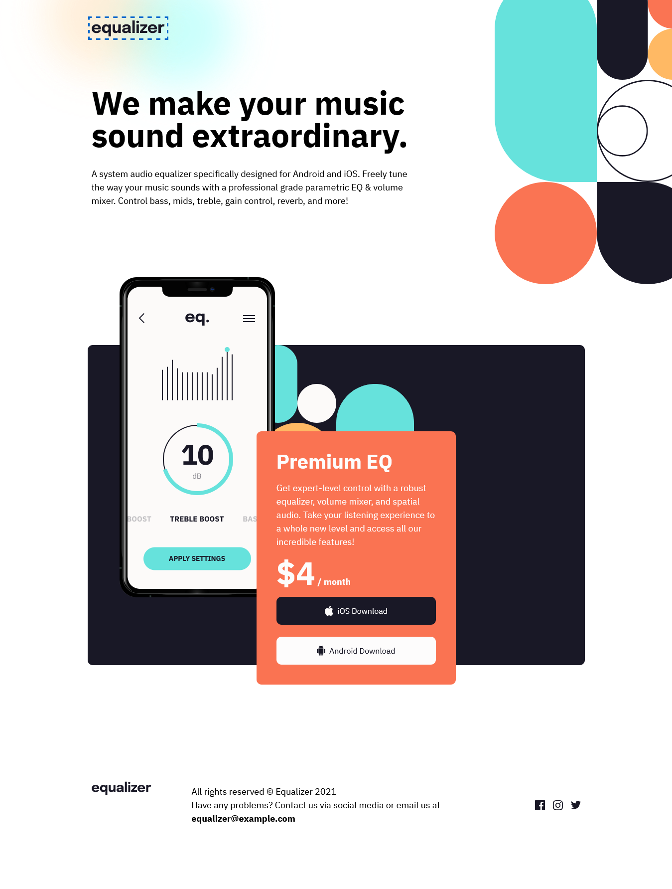
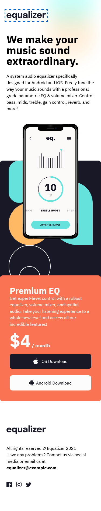

# Frontend Mentor - Equalizer landing page solution

This is a solution to the [Equalizer landing page challenge on Frontend Mentor](https://www.frontendmentor.io/challenges/equalizer-landing-page-7VJ4gp3DE). Frontend Mentor challenges help you improve your coding skills by building realistic projects. 

## Table of contents

- [Overview](#overview)
  - [The challenge](#the-challenge)
  - [Screenshot](#screenshot)
  - [Links](#links)
- [My process](#my-process)
  - [Built with](#built-with)
  - [What I learned](#what-i-learned)
  - [Continued development](#continued-development)
  - [Useful resources](#useful-resources)
- [Author](#author)
- [Acknowledgments](#acknowledgments)

## Overview

### The challenge

Users should be able to:

- View the optimal layout depending on their device's screen size
- See hover states for interactive elements

### Screenshot





### Links

- Frontend Mentor Solution URL: [Add solution URL here](https://your-solution-url.com)
- Live Site URL: [live preview](https://chamumutezva.github.io/equaliser-landing-page/)

## My process

### Built with

- Semantic HTML5 markup
- CSS custom properties
- css custom classes
- Flexbox
- CSS Grid
- Mobile-first workflow


**Note: These are just examples. Delete this note and replace the list above with your own choices**

### What I learned

- creating custom properties and custom classes following a tutorial by Kevin Powell

```css
:root {
    --clr-dark: 244 23% 12%;
    /*#191826*/
}

/* usage */
.bg-dark {
    background-color: hsl(var(--clr-dark));
}
```

### Continued development

Progressive web application

### Useful resources

- css filter [css filter generator codepen](https://codepen.io/sosuke/pen/Pjoqqp)
- [Example resource 1](https://www.example.com) - This helped me for XYZ reason. I really liked this pattern and will use it going forward.


## Author

- Website - Chamu Mutezva
- Frontend Mentor - @ChamuMutezva
- Twitter - @ChamuMutezva


